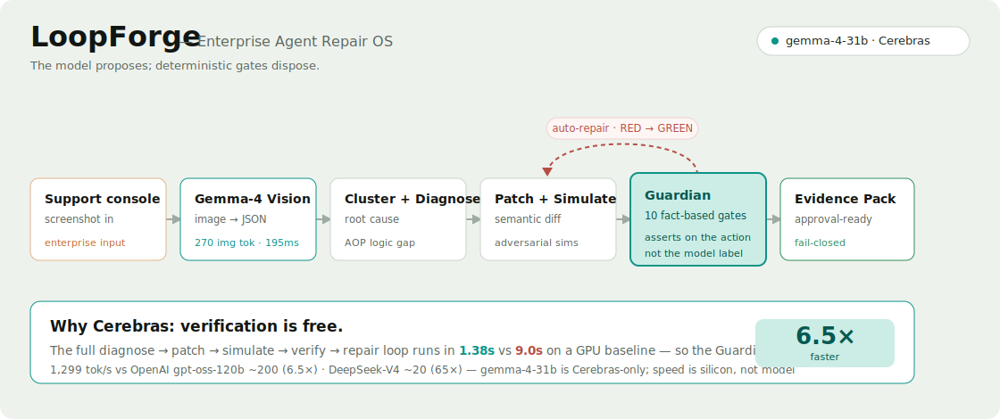

# LoopForge - Enterprise Agent Repair OS

**Live demo: https://loopforge-ai.pages.dev/** · Cerebras × Google DeepMind Gemma 4 Hackathon (Track 3: Enterprise Impact)

LoopForge turns production support failures into an approval-ready agent workflow fix. The demo scenario is a fintech support agent that over-escalates subscription-charge disputes instead of verifying identity, checking posted or pending charge status, selecting the dispute eligibility tool, and enforcing risk gates.

The primary model path is Cerebras Gemma 4 31B with model ID `gemma-4-31b`. The app ships with deterministic recorded mode, so the demo works without API quota or network access.



> The model proposes; deterministic gates dispose. The full diagnose → patch → simulate → verify → repair loop runs in **1.38s** vs **~9s** on OpenAI's 120B gpt-oss on a GPU (**6.5×**, and **~65×** vs DeepSeek-V4) — verification is free, so the Guardian runs every cycle.

## Setup

```bash
npm install
npm run dev
```

Open the local Vite URL shown in the terminal.

## Environment Variables

Live Cerebras mode reads secrets only on the local Vite server side.

- `CEREBRAS_API_KEY`: required for live Cerebras mode.
- `CEREBRAS_MODEL`: optional, defaults to `gemma-4-31b`.
- `LOOPFORGE_SOURCE_ENV`: optional absolute path to an external env file to read keys from. By default the dev server reads only the project's own `.env.local` / process env. See `.env.example`.
- `BASELINE_PROVIDER`: optional, for example `fireworks` or `simulation`.
- `BASELINE_API_KEY`: optional live baseline key.
- `BASELINE_BASE_URL`: optional OpenAI-compatible baseline URL.
- `BASELINE_MODEL`: optional live baseline model.
- `FIREWORKS_API_KEY`: optional fallback baseline key when `BASELINE_API_KEY` is not set.

If live Cerebras mode is missing `CEREBRAS_API_KEY`, the app shows a safe setup message naming only the missing variable.

## How It Works

The React app renders a premium enterprise control plane:

- Command Center
- Speed Race
- Failure Cluster
- Root Cause
- Workflow Patch Diff
- Simulation Generator
- Validation Gates
- Evidence Pack

The local Vite middleware handles `/api/loopforge/run`. It loads env values server-side, calls Cerebras chat completions with structured JSON output, validates model output with Zod, runs deterministic TypeScript gates, and returns the final run object to the UI.

## Cerebras Integration

Live mode calls `https://api.cerebras.ai/v1/chat/completions` with `gemma-4-31b`.

LoopForge uses Gemma 4 on Cerebras for:

- failure clustering
- root-cause diagnosis
- workflow patch proposal
- simulation generation
- evidence pack generation

The app captures and displays Cerebras timing fields when available: `response.time_info.total_time`, `queue_time`, `completion_time`, `prompt_tokens`, `completion_tokens`, and computed output tokens per second.

## Speed Comparison

The Speed Race compares the Cerebras repair loop against the **GPU open-model field** an enterprise would actually deploy — `gemma-4-31b` is Cerebras private-preview only, so the identical model can't run on a GPU. The headline baseline is a **real measured Fireworks `gpt-oss-120b` GPU run** — OpenAI's open-weight 120B model, 4× larger than ours, at ~200 tok/s — normalized to the same generated-token budget. Measured Cerebras `gemma-4-31b` sustains ~1,050–1,300 tok/s, for a **~6.5×** advantage; the field spans 6.5× (gpt-oss-120b) to **~65×** (DeepSeek-V4). This is a hardware comparison: speed is a property of the silicon, not the model.

To re-measure live, set `BASELINE_PROVIDER=fireworks` and `BASELINE_MODEL=accounts/fireworks/models/gpt-oss-120b` with `FIREWORKS_API_KEY` (the older `llama-v3p1-70b-instruct` id is not served on the current key). If no real baseline is configured or a request fails, the UI labels the comparison as a clearly-marked projection and never claims a live GPU measurement unless one completed.

## Validation Harness

The deterministic harness enforces:

- identity gate
- tool schema gate
- eligibility gate
- pending-charge gate
- fraud-routing gate
- high-dollar escalation gate
- prompt-injection gate
- disclosure gate
- regression gate

Model output is never treated as final approval without passing these gates.

## Security And Privacy

Only synthetic seed data is included. No real customer data is used.

Secrets are not copied into the repo or exposed to the browser. `.gitignore` excludes `.env*`, local files, logs, and recordings. The app names missing env variables but never prints secret values.

## Submission Kit (Track 3 — Enterprise Impact)

- [docs/DEMO_SCRIPT.md](docs/DEMO_SCRIPT.md) — the recordable 60-second video script (shot-by-shot + voiceover).
- [docs/SUBMISSION.md](docs/SUBMISSION.md) — the Discord submission note + X/Twitter thread, ready to paste.
- [docs/JUDGE_QA.md](docs/JUDGE_QA.md) — judge Q&A / technical-depth one-pager.
- [docs/ARCHITECTURE.md](docs/ARCHITECTURE.md) · [docs/SECURITY.md](docs/SECURITY.md) · [docs/JUDGING_NARRATIVE.md](docs/JUDGING_NARRATIVE.md)
- `public/architecture.svg` — the architecture diagram (above) for the README and as a video slide.
