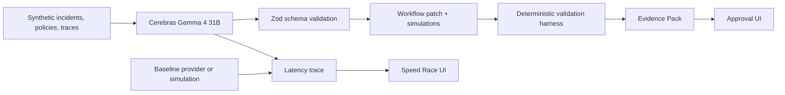

# Architecture

LoopForge is a Vite + React + TypeScript app with a local server-side API.

## Flow

## Runtime

- `src/server/devApi.ts` exposes `/api/loopforge/run` in Vite dev mode.
- `src/server/env.ts` reads local env files without logging values.
- `src/server/orchestrator.ts` coordinates model calls, validation, fallback, and latency aggregation.
- `src/lib/cerebrasClient.ts` calls Cerebras with structured JSON output.
- `src/lib/baselineClient.ts` runs a configurable OpenAI-compatible baseline or returns a labeled simulation.
- `src/lib/validationHarness.ts` enforces deterministic gates.
- `src/components/*` renders the control plane.

## Recorded Mode

`src/data/recordedRuns.json` contains a deterministic synthetic run. The UI loads this immediately and can reset to it at any time.

## Live Mode

Live mode requires `CEREBRAS_API_KEY`. The app uses `gemma-4-31b` unless `CEREBRAS_MODEL` is set. If a live call fails after configuration is present, the server returns a `live-fallback` run based on recorded data and labels the fallback.
